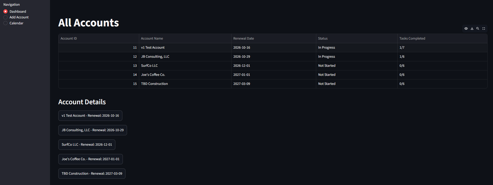
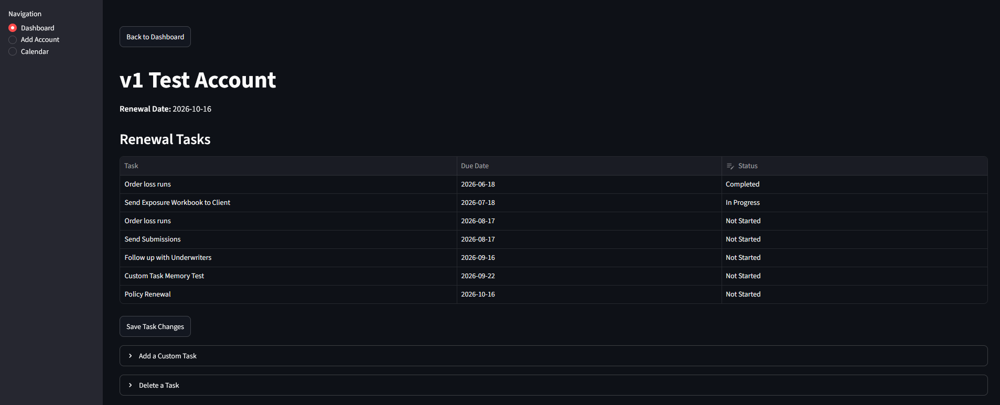
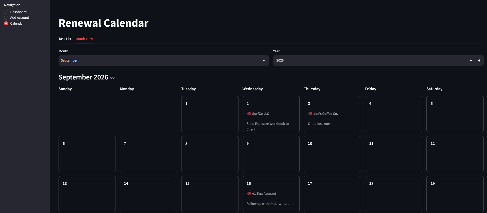

# Renewal Tracker

A Python-based renewal workflow application designed to help commercial insurance professionals organize and track the renewal process.

After developing an interest in learning Python and software creation fundamentals, I decided that I could hone my skills through creating something that would eventually help everyday commercial broker workflows. 
One recurring inconvenience I noticed is keeping standard dates and follow-ups organized across multiple accounts and renewal dates. The goal was to create a tool that could seamlessly upload important renewal dates and reminders to your calendar. A more advanced version would then upload these items directly to outside calendar software.
This project started as a command-line tool that generated renewal task dates, and has now evolved into a database-backed Streamlit application.

## Current Features
- Automated renewal schedules:
    Generates renewal tasks based on the account's renewal date and user-determined lead times
- Account Management:
    Create and manage specific accounts and schedules
- Task Management:
    Track, update, and delete specific and standardized tasks across all accounts
- Progress Tracking
    Display current progress specific to the tasks and dates for each account
- Calendar
    View tasks in both list and monthly calendar formats
- CSV export
    Download renewal schedules for use in Excel or other external tools
- Persistent Storage
    Use SQLite to store account data between application sessions

## Screenshots
### Account Dashboard

### Account Details

### Renewal Calendar

## Tech Stack
- Python
    Core language used for app logic and database interactions
- Streamlit
    Provides simple web-based UI and interactive app features
- SQLite
    Stores account data locally with persistent database storage
- Pandas
    Organizes and displays data in tabular form

## Project Structure
- app.py
    Main Streamlit application containing UI and app flow
- database.py
    Handles SQLite database operations
- automator_logic.py
    Contains the renewal schedule generation logic that is used to calculate due dates
- renewal_tracker_cli.py
    Original command-line prototype; retained to show project progression

## Running Locally
1. Clone the repository and move into the project folder:
    git clone <repository-url>
    cd <repository-folder>
2. Create a Python virtual environment
    python -m venv .venv
3. Activate the virtual environment
    .venv\Scripts\activate
4. Install the required dependencies
    pip install -r requirements.txt
5. Start the Streamlit application:
    streamlit run app.py
The application will create its local SQLite database automatically when it is first launched.

## Project Development
The Renewal Tracker has been built incrementally as I learn Python and software development fundamentals:
1. CLI Prototype
    The original application was a command-line interface in Python with CSV storage and extraction.
2. Streamlit Interface
    The CLI was converted into a web-based application with navigation, forms, account pages, and some task management features.
3. SQLite Database
    Replaced the CSV storage components with a dynamic database that connects accounts to their individual tasks and due dates while preserving data between sessions.
4. Current v1
    Added task progress tracking, editable task statuses, custom task creation, task deletion, CSV exports, and calendar view.

## Future Development
Next steps would be talking to potential users, implementing UI, and developing API connection to external platforms such as Outlook and Google Calendar.
- User Feedback:
    The most useful next step would be gathering feedback from commercial insurance professionals to determine which features provide the most benefit. The goal is for it to save brokers time and keep their schedules organized, but I want to make sure that it operates smoothly and does not feel like another task.
- Implementing UI:
    As it stands, the app is in the default Streamlit format. Developing a professional and clean interface would provide more visual appeal. As the project continues to develop, I may explore other frontend tech/software that is more customizable, depending on the limitations of the current interface.
- API Progression:
    The best form of this app would most likely allow the user or AI to input account information which would then automatically update the user's calendar in any outside software.
    Ex. you assign accounts to a new AM and their schedule auto populates important dates for each account. These dates can then be customized via the app or the calendar itself.